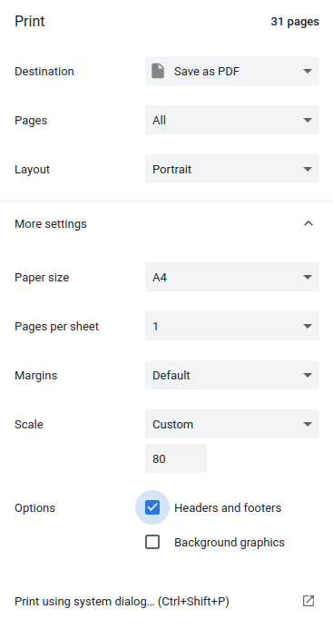

CodePrinter: print code to pdf
### Example
1. Print *.py files
```
python demo.py -c path/to/your/code -f py
```
2. Print *.cpp  and *.py files
```
python demo.py -c path/to/your/code -f cpp,py
```
### Use GoogleChrome to open CodePrinter.html and print it
